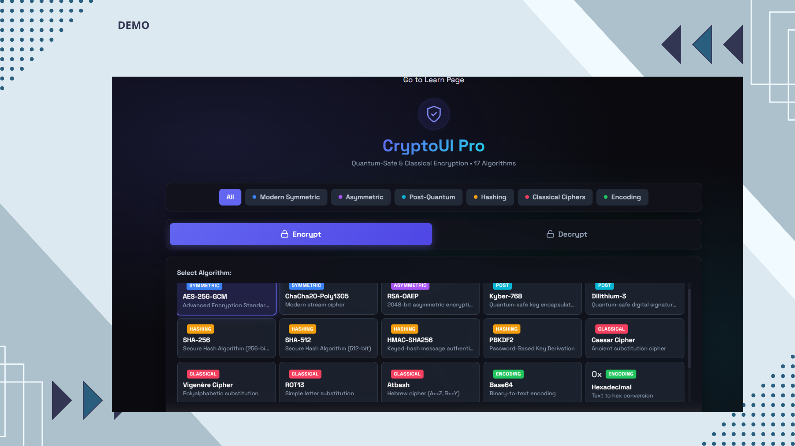
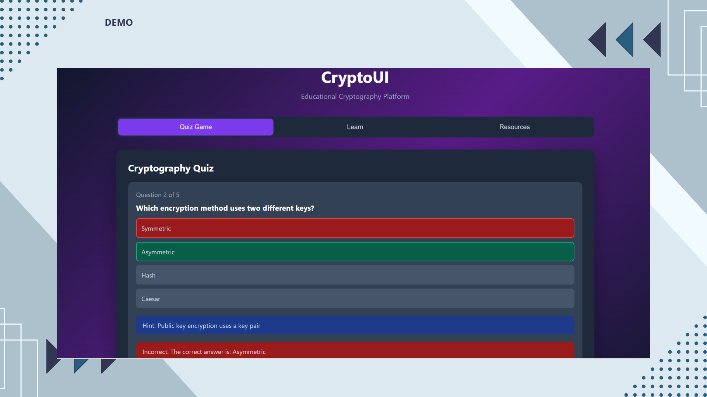
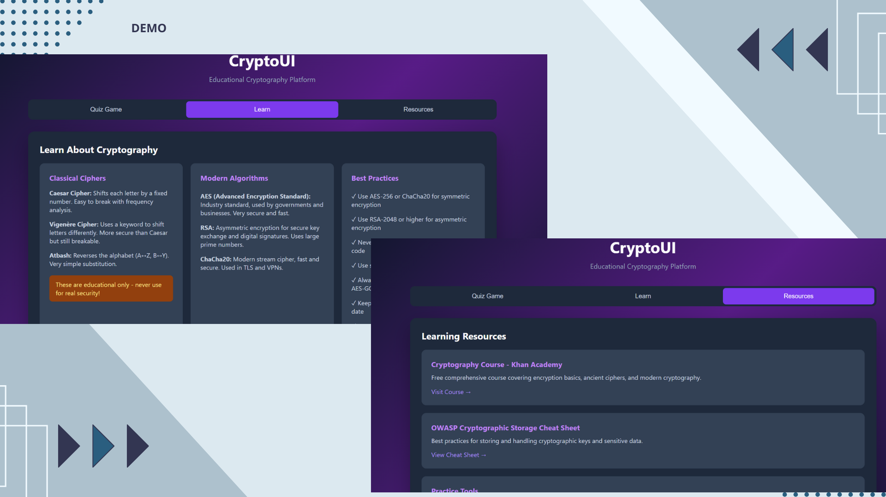
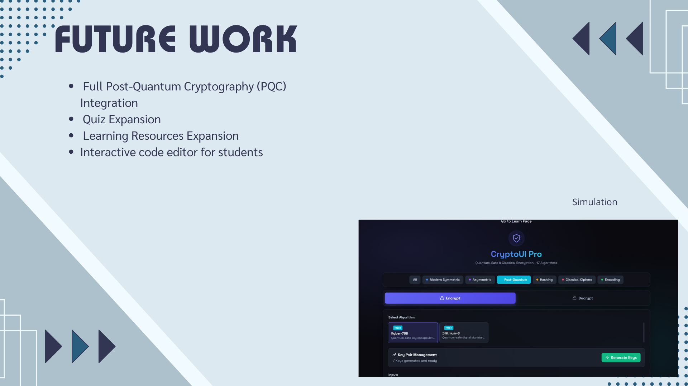

# 🔐 CryptoUI – Interactive Web Cryptography Learning Platform

**CryptoUI** is a web-based cryptographic interface for learning and experimentation.  
It allows users to perform real-time encryption, decryption, and hashing, explore classical ciphers, and test their knowledge through quizzes.

---

## Purpose
- Provide an interactive way to **learn modern and classical cryptography**
- Demonstrate **encryption / decryption / hashing** live in the browser
- Encourage self-learning with built-in **quizzes and resources**
- Designed for **students, researchers, and cybersecurity enthusiasts**

---

## Tech Stack
- **Frontend:** React 18, Tailwind CSS, Babel (in-browser JSX compilation)
- **Crypto Engine:** Web Crypto API (AES-GCM, RSA-OAEP, PBKDF2, HMAC-SHA256)
- **Educational Ciphers:** Caesar, Vigenère, ROT13, Atbash
- **Architecture:** Single Page Application (SPA) using React Hooks
- **Tools:** npm, http-server, VS Code

---

## Features
✅ Real-time encryption/decryption  
✅ Hashing and key derivation (PBKDF2, SHA-256/512)  
✅ Classic cipher simulators (Caesar / Vigenère / Atbash / ROT13)  
✅ Interactive quizzes for learning  
✅ Educational “Learn” section with best-practice guides  

---

##  How to Open and Run the Project

1️⃣ **Download the ZIP**
   - Click on `Project new.zip` in this repository  
   - Then click **Download**

2️⃣ **Extract the ZIP**
   - Right-click → “Extract All”  
   - The extracted folder will contain the full CryptoUI web app files.

3️⃣ **Run the Project**
   - If it’s a React/Tailwind setup:
     ```bash
     npm install
     npm run dev
     ```
     Then visit:
     ```
     http://localhost:3000
     ```

   - If it’s plain HTML/JS:
     ```bash
     npx http-server .
     ```
     Then visit:
     ```
     http://localhost:8080
     ```

---

## Algorithms Implemented
### Modern Cryptography
- AES-256-GCM  
- RSA-OAEP-SHA256  
- PBKDF2 (key derivation)  
- HMAC-SHA256  
- SHA-256 / SHA-512  

### Classical Ciphers (Educational)
- Caesar Cipher  
- Vigenère Cipher  
- Atbash Cipher  
- ROT13  

### Encodings
- Base64, Hex, Binary  

---

##  Demonstration Screenshots

### 🔹 Main Interface


### 🔹 Quiz Module


### 🔹 Learn Page


### 🔹 Future Work


---

## 🔒 Future Work
- Full Post-Quantum Cryptography (PQC) Integration  
- More Quizzes & Learning Modules  
- Interactive Code Editor for Students  

---

## 📚 References
1. [Web Crypto API – W3C](https://www.w3.org/TR/WebCryptoAPI/)  
2. [MDN SubtleCrypto Docs](https://developer.mozilla.org/en-US/docs/Web/API/SubtleCrypto)  
3. [React Documentation](https://react.dev/)  
4. [Tailwind CSS Docs](https://tailwindcss.com/docs)  
5. [Babel Standalone](https://babeljs.io/docs/babel-standalone)  
6. [MDPI Cryptography 2025 – Kyber Analysis](https://www.mdpi.com/2410-387X/9/2/32)

---

## 🧑‍💻 Author
**Devika Kishor**  
Master’s Student in Cybersecurity, Florida Institute of Technology  

---

## ⚠️ License
This project is shared for **academic and educational purposes** only.  


